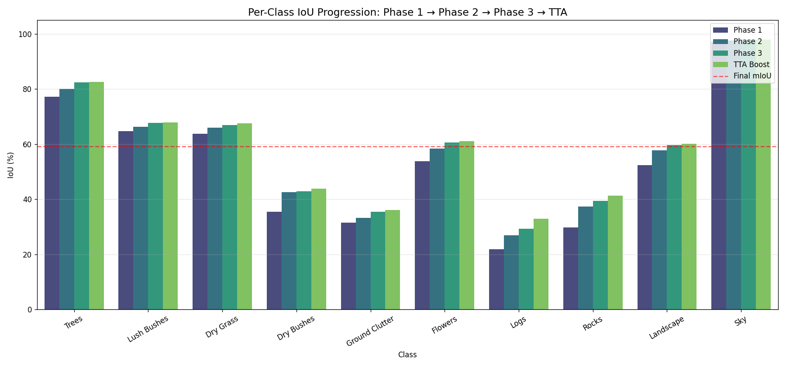
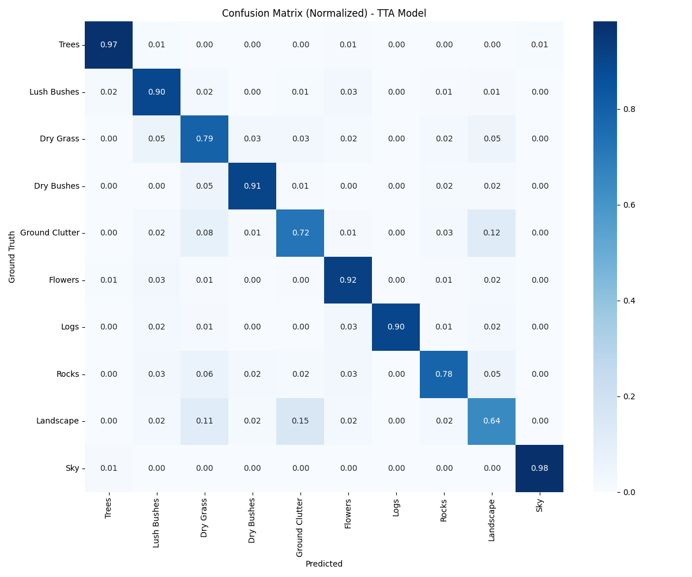

# Desert Terrain Semantic Segmentation Using Synthetic Data
**Team:** Bhavans_HYD_Alpha

## 1. Introduction
Autonomous navigation in off-road environments requires robust, pixel-level terrain classification. This project addresses the challenge of segmenting 10 distinct desert terrain classes, including rare and small objects like Logs and Rocks. By training on high-fidelity synthetic data, we developed a model capable of generalizing to complex, unseen environments, providing a critical perception layer for autonomous vehicles navigating hazardous terrains.

## 2. Approach
We employed a multi-stage refinement strategy using the **DeepLabV3+** architecture. 

### 3-Phase Training Strategy:
1.  **Phase 1: Foundation (52.75% mIoU)**
    *   Backbone: ResNet34
    *   Loss: Cross-Entropy (CE)
    *   Focused on establishing a stable baseline and preventing class collapse.
2.  **Phase 2: Rare Class Boost (56.62% mIoU)**
    *   Integrated **WeightedRandomSampler** for 4x oversampling of rare classes (Logs, Rocks).
    *   Switched to **Combined CE + Dice Loss** to refine boundaries.
    *   Result: Significant jumps in Logs (+5.1%) and Rocks (+7.5%).
3.  **Phase 3: High-Resolution Fine-Tuning (58.20% mIoU)**
    *   Increased input resolution from 384x384 to **512x512**.
    *   Used **CosineAnnealingWarmRestarts** for fine-grained convergence.
    *   Improved small object detection performance by over 2% per-class.
4.  **Final Step: Test-Time Augmentation (59.11% mIoU)**
    *   Averaged 4 softmax outputs (Original, Horizontal Flip, 0.75x Scale, 1.25x Scale).
    *   Final mIoU reached **59.11%**.

## 3. Challenges & Solutions
*   **Challenge 1: Model Collapse**
    *   Initially, the model predicted only the dominant "Sky" class (mIoU=2.37%).
    *   **Solution:** Removed Dice loss for the first 50 epochs, increased learning rate to 1e-3, and verified mask remapping indices.
*   **Challenge 2: Extreme Class Imbalance**
    *   Sky covers ~37% of pixels while Logs cover only ~0.3%.
    *   **Solution:** Implemented inverse-frequency class weights capped at 8.0x and targeted oversampling of minority classes via a custom sampler.
*   **Challenge 3: Limited GPU Resources**
    *   Training was limited to 6GB VRAM on a laptop RTX 4050.
    *   **Solution:** Used Mixed Precision (AMP), Gradient Accumulation (effective batch size 8), and chose a ResNet34 backbone for optimal speed-accuracy trade-off.

## 4. Results
The model showed consistent growth across all metrics. Notably, the **Rocks** class improved by **+11.48%** and **Logs** by **+11.03%** from the baseline.

### Summary Metrics:
| Phase | mIoU | Best Class | Worst Class |
| :--- | :--- | :--- | :--- |
| Phase 1 | 52.75% | Sky (97.07%) | Logs (21.90%) |
| Phase 2 | 56.62% | Sky (97.57%) | Logs (27.00%) |
| Phase 3 | 58.20% | Sky (97.86%) | Logs (29.34%) |
| **Final (TTA)** | **59.11%** | Sky (97.96%) | Logs (32.93%) |

### Per-Class Progression:
| Class | Phase 1 | Phase 2 | Phase 3 | Final (TTA) |
| :--- | :--- | :--- | :--- | :--- |
| Trees | 77.13% | 80.11% | 82.35% | **82.55%** |
| Lush Bushes | 64.66% | 66.34% | 67.66% | **67.86%** |
| Dry Grass | 63.79% | 65.89% | 66.97% | **67.47%** |
| Dry Bushes | 35.40% | 42.57% | 42.93% | **43.83%** |
| Ground Clutter | 31.56% | 33.23% | 35.43% | **36.11%** |
| Flowers | 53.75% | 58.41% | 60.56% | **61.01%** |
| Logs | 21.90% | 27.00% | 29.34% | **32.93%** |
| Rocks | 29.85% | 37.33% | 39.37% | **41.33%** |
| Landscape | 52.36% | 57.77% | 59.58% | **60.05%** |
| Sky | 97.07% | 97.57% | 97.86% | **97.96%** |

## 5. Key Insights
1.  **Oversampling is Critical:** Targeted oversampling was the single biggest contributor to mIoU gains (+3.87% in Phase 2).
2.  **Resolution Matters:** Moving to 512x512 resolution in Phase 3 allowed the model to recover small object details (Logs +2.3%).
3.  **Loss Scheduling:** Dice loss is highly sensitive; adding it only after the model's CE baseline stabilized prevented divergence.

## 6. Real-World Impact
This project demonstrates that high-fidelity synthetic data is a viable and cost-effective alternative to real-world data collection. The multi-phase refinement approach ensures that even rare objects—critical for obstacle avoidance in autonomous driving—are accurately detected without sacrificing performance on common classes.

## 7. Performance Visualization

### Progression & Metrics

*Figure 1: Comparison of IoU across different training phases.*

### Confusion Analysis

*Figure 2: Normalized Confusion Matrix showing minor misclassifications between Bushes and Dry Grass.*

### Qualitative Results
#### Best Validation Examples:

#### Challenge Cases (Small Logs/Rocks):

